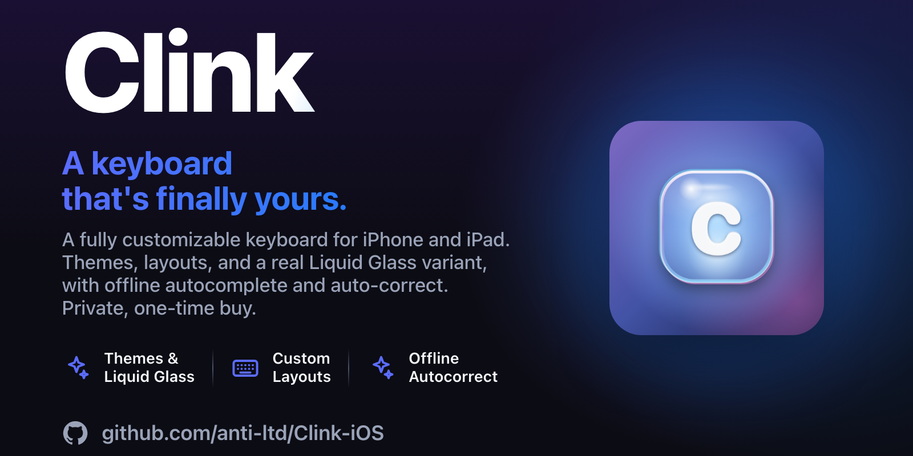
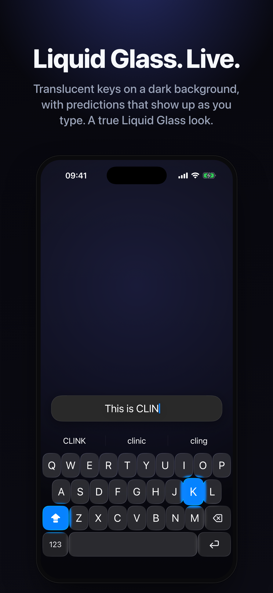
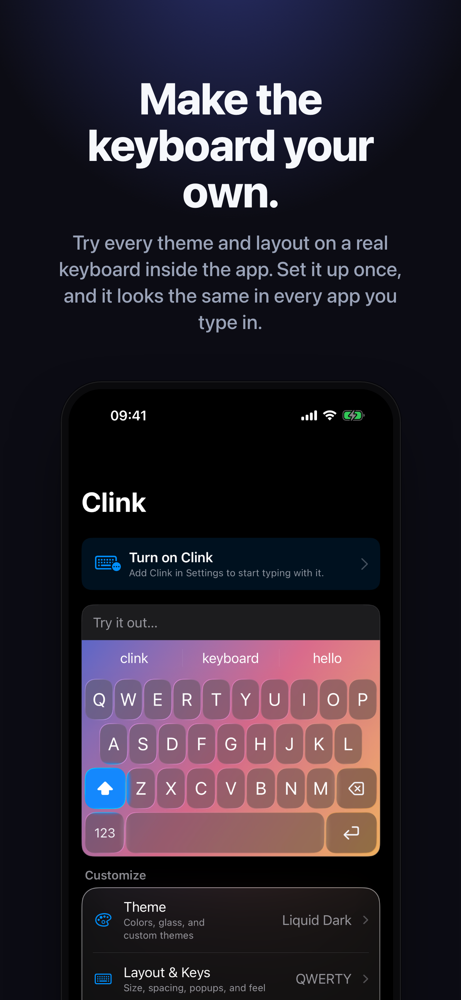
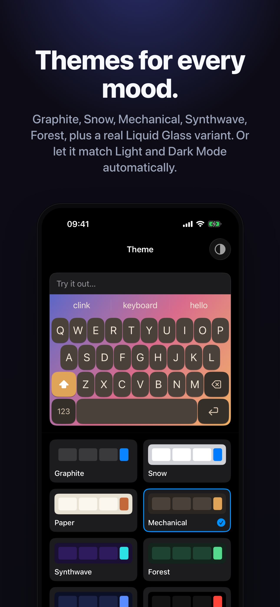
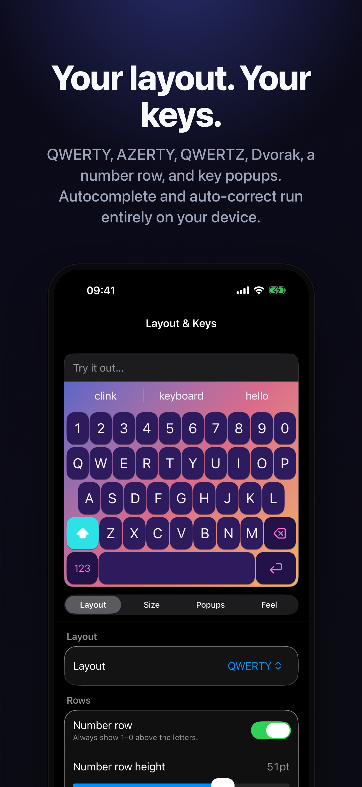

<div align="center">



<br>


<br><br>

# Clink

**A fully customizable iOS keyboard.**


[](LICENSE.md)


</div>

---

> A custom iOS keyboard you can make completely your own — 30 built-in themes
> (including a Liquid Glass collection for iOS 26), four layouts, offline
> autocomplete and autocorrect, swipe typing, custom keys, clipboard history, a
> quick notepad, calculator, custom Python actions, and a full custom-theme
> builder. Private by default: it works completely without Full Access, and never
> phones home. The iOS sibling of clonk-macos.

---

## Screenshots

<div align="center">

| Liquid Glass | Make it yours | Themes | Layouts |
|:---:|:---:|:---:|:---:|
|  |  |  |  |

</div>

Regenerate with the [AppStage](https://github.com/anti-ltd/AppStage-MacOS) pipeline:

```bash
appstage capture clink && appstage build clink && appstage sync clink
```

It Debug-builds Clink, boots the iOS Simulator, routes the app to each screen
via `--appstage <slug>` launch args (seeding a curated theme so the live preview
looks its best), and writes device-framed PNGs into `Resources/screenshots/`.
The routing is `#if DEBUG` — none of it ships in Release.

---

## Features

**Themes**
- 30 built-in presets across dark, light, and six Liquid Glass variants (iOS 26)
- Custom theme builder: solid or Liquid Glass material, font design (sans / serif),
  per-color pickers, gradient editor (linear / radial, multi-stop), and photo backgrounds
- Export / import themes as `.clink` files; duplicate any preset as a starting point
- Match-system-appearance mode: separate light and dark theme, auto-switched

**Layouts & keys**
- Four layouts: QWERTY, AZERTY, QWERTZ, Dvorak
- Optional number row, home-row inset, adjustable key height / width / spacing / roundness
- Key popups: standard balloon or Liquid Glass bubble, position and size tunable
- Liquid key press: bloom + warp animation on each key; independently tunable springs

**Text**
- Offline autocomplete + autocorrect — `UITextChecker` plus bundled frequency
  lexicons (`.clex`) and bigram models (`.cngm`); no network, no telemetry
- Swipe / glide typing with geometry-matched word decoding
- Smart punctuation: curly quotes, double-space to period, contraction apostrophes
- Auto-capitalize, auto-return-to-letters after symbols, configurable per preference
- Optional on-device learning: remembers words you type and corrections you reject

**Panels**
- Clipboard history: FIFO list, pin entries, bar or overlay display style
- Quick notepad: scratchpad buffer or saved-notes archive, drop text anywhere
- Calculator: arithmetic overlay, insert result into the document
- Full emoji keyboard with skin-tone picking, per-emoji tone memory, recents tab
- Custom actions: Python-subset scripts (`transform(text)`) behind the panel picker
- Custom panels: user-authored UI panels via the same PyMini runtime
- Panel switcher: tap the suggestion-bar icon or slide up on 123; cards or cycling picker

**Customization**
- Custom keys and rows: insert text or trigger function actions
- Per-key hitbox tuning; adaptive next-letter target sizing from lexicon bigrams
- Motion system: fixed animation tokens + user-tunable key/space/popup springs
- Export / import whole config as `.clinkconfig`; per-theme `.clink` files

**Sound & haptics**
- Per-keypress sound packs; standard system click works without Full Access
- Volume slider, per-keypress haptics (requires Full Access)

**Cursor**
- Spacebar cursor: slide to move the cursor; three modes (slide / trackpad / combined)
- Configurable activation delay, scroll sensitivity, and line stride

---

## Documentation

**[docs/](docs/README.md)** — full codebase learning guide: module walkthroughs,
how-to guides (themes, motion, panels, extensions SDK), and a
[file index](docs/FILE-INDEX.md) for all 153 Swift sources.

---

## Architecture

Clink ships as **two targets plus shared code** — not a single app:

```
Clink (container app)  ──embeds──▶  ClinkKeyboard.appex (the keyboard)
        │                                   │
        └──────── App Group ────────────────┘
              group.ltd.anti.clink
     (settings written by app, read by keyboard; file-based, not UserDefaults)
```

- **`Clink`** — the App Store product: onboarding, enable flow, all settings,
  and a live interactive preview of the keyboard.
- **`ClinkKeyboard`** — a `UIInputViewController` extension; the keyboard that
  runs inside other apps.
- **`Sources/ClinkKit`** — shared code compiled into *both* targets (no dynamic
  framework, so no extension-embedding / rpath pitfalls). Includes
  **`KeyboardCanvas`** — the keyboard view itself — so the in-app preview is the
  *exact same SwiftUI view* the extension renders.

`SharedStore` persists `KeyboardSettings` as a JSON file in the App Group
container, not `UserDefaults(suiteName:)`. `cfprefsd` can return stale values
for minutes when the suite is written from one process and read from another;
file-based I/O reads the current bytes every time.

### Source layout

High-level map — see [docs/FILE-INDEX.md](docs/FILE-INDEX.md) for every Swift
file (153 total) and [docs/README.md](docs/README.md) for module walkthroughs.

```
Sources/
├── ClinkKit/                       shared (compiled into both targets)
│   ├── Theme/                      Theme.swift, ThemeTypes, RGBA, 30× Theme+<Name>, photos
│   ├── Settings + IPC              KeyboardSettings, SharedStore, FeatureFlags
│   ├── Keyboard core               KeyboardCanvas ⭐, KeyboardController, KeyboardLayout, keys
│   ├── Touch + input               KeyTouchRouter, AdaptiveHitbox, SwipeDecoder, accents
│   ├── Prediction                  SuggestionEngine, Lexicon (.clex), NgramModel (.cngm),
│   │                               CorrectionScorer, UserAdaptation, AIEngine (iOS 26+)
│   ├── Emoji                       EmojiCanvas, EmojiData.generated (make emoji)
│   ├── Action panels               clipboard, notepad, calculator, panel switcher
│   ├── Extensions/                 custom PyMini actions (ClinkExtension, ExtensionsPanel)
│   ├── Panels/                     custom PyMini UI panels (ClinkPanel, PanelRuntime)
│   ├── PyMini/                     sandboxed Python-subset interpreter
│   ├── Motion/                     Motion tokens, MotionProfile, MotionSequence
│   └── Sound                       SoundPack, SoundPlayer
│
├── Clink/                          container app
│   ├── ClinkApp.swift, AppModel.swift, AppStage.swift
│   └── UI/                         sidebar settings shell + live KeyboardPreview
│       ├── RootView.swift          collapsible sidebar (Style / Typing / Feel / Setup)
│       ├── theme, layout, keys, typing, panels, extensions, sound, backup…
│       └── Panels/, Extensions/    script editors + live preview
│
└── ClinkKeyboard/
    └── KeyboardViewController.swift  extension host: proxy, suggestions, sound, IPC
```

---

## Privacy & Full Access

iOS custom keyboards can request **Full Access**, which shows a system warning.
Clink is **privacy-first**: it works completely without it (you get the standard
system click), and never transmits anything. Full Access is optional — iOS only
lets keyboard extensions fire haptics and read from the clipboard when it is
granted, so those two features ask for it. Nothing else does.

---

## Build

Requires **Xcode 16+** with the **iOS 17+ platform installed**, and `xcodegen`
(`brew install xcodegen`).

Depends on **[iUX-ios](../iUX-ios)** — shared iOS design system — via a local
path. Check it out as a sibling directory before building:

```
Projects/
├── Clink-iOS/   ← this repo
└── iUX-ios/     ← shared iOS design system
```

```bash
make icon      # render the app icon from Tools/RenderAppIcon.swift
make project   # regenerate Clink.xcodeproj from project.yml (needs xcodegen)
make lexicons  # compile .clex / .cngm frequency dictionaries (Tools/GenerateLexicons.swift)
make emoji     # regenerate EmojiData.generated.swift from Tools/emoji-test.txt
make build     # xcodebuild for the iOS Simulator
make run       # boot the sim, install, launch
make test      # unit tests on the simulator
make device    # build, sign, install on the paired iPhone
make clean     # remove build/ and Clink.xcodeproj
make help      # list every target
```

`project.yml` is the source of truth — `.xcodeproj` is generated by
[XcodeGen](https://github.com/yonaskolb/XcodeGen) and gitignored. **Never edit
the generated `.xcodeproj` by hand.**

### Liquid Glass

Liquid Glass effects (`GlassEffectContainer`, `.glassEffect()`) are
`@available(iOS 26.0, *)` guarded throughout. The app deploys to iOS 17;
glass themes simply render a `.ultraThinMaterial` fallback on earlier OS versions.

### Generated files

| Output | Source | Command |
|---|---|---|
| `Sources/ClinkKit/EmojiData.generated.swift` | `Tools/emoji-test.txt` (Unicode 16.0) | `make emoji` |
| `Resources/Lexicons/*.clex`, `*.cngm` | wordlists under `Tools/wordlists/` | `make lexicons` |

Only needed when updating the emoji set or lexicon wordlists. Format details in
`Tools/GenerateLexicons.swift` and [docs/04-prediction.md](docs/04-prediction.md).

---

## Enabling the keyboard

1. **Settings → General → Keyboard → Keyboards → Add New Keyboard… → Clink**
2. Switch to it from any app by holding the 🌐 globe key.
3. *(Optional)* **Clink → Allow Full Access** for per-keypress haptics and
   clipboard history.

The in-app **Setup** screen walks through this and deep-links to Settings.

---

## Community

Questions, theme sharing, feedback, or just saying hi — join the Discord:

**[anti.ltd/discord](https://anti.ltd/discord)** · **[counter.ltd/discord](https://counter.ltd/discord)**

---

## License

Clink is source-available under the **Counter-Limitation License (CLL) v1.2** —
see [LICENSE.md](LICENSE.md).

© 2026 Anti Limited.
